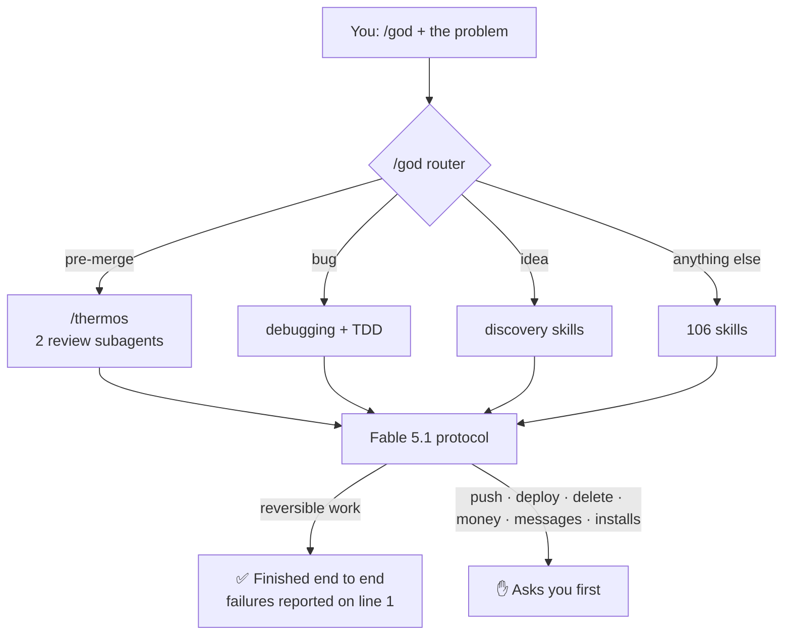

<div align="center">


# ⚡ DEV GOD-MODE

### Describe the problem. `/god` picks the right skills and sees the job through.

106 expert skills, 6 review subagents and one execution protocol for **Claude Code, Antigravity, Cursor and Windsurf**.<br/>
It finishes reversible work end to end, and asks you before anything it can't undo.

[](https://github.com/Gastonchevarria/god-mode/releases)
[](https://github.com/Gastonchevarria/god-mode/actions/workflows/ci.yml)
[](#-pick-a-pack)
[](LICENSE)

**[Install in 30 seconds](#-install-in-30-seconds)** · [See it work](#-see-it-work) · [The 5 commands](#-the-5-commands-worth-memorizing) · [How it works](#-how-it-works) · [FAQ](#-faq)

</div>

---

## 🤔 Why god-mode?

AI coding agents are powerful, but you have probably hit these walls:

| Without god-mode | With god-mode |
| :--- | :--- |
| You have to know which skill or prompt fits the job | Type `/god` and describe the problem. It routes to the right skills for you |
| The agent stops halfway: *"now you implement steps 4 and 5"* | It finishes every reversible step, then checks its own last paragraph for loose ends |
| It says "done" while a test quietly failed | Failures go on the **first line** of the reply, never buried in a summary |
| An eager agent pushes, deploys or deletes on its own | It **stops and asks** before push, deploy, delete, migrations, money, credentials, messages or installs |
| Every skill you add eats context | Pick a pack. All 106 descriptions fit in about 7,300 tokens |
| Your rules only work in one editor | One protocol for Claude Code, Antigravity, Cursor and Windsurf |

---

## 🚀 Install in 30 seconds

Pick **one** way to install. Both give you the same skills.

| | **A. Installer** (recommended) | **B. Claude Code plugins** |
| :--- | :--- | :--- |
| **Best for** | Using god-mode everywhere, with the protocol always on | Trying it in Claude Code with nothing global changed |
| **Protocol** | Active in every session (managed block in `~/.claude/CLAUDE.md`, your own rules kept) | Loaded only when you run `/god` |
| **Antigravity** | ✅ Installed automatically if `~/.gemini` exists | ❌ |
| **Cursor / Windsurf** | ✅ With `--cursor` or `god-mode cursor <project>` | ❌ |
| **Updates** | `god-mode update` | `/plugin marketplace update god-mode` |

**A. Installer** (macOS / Linux, needs `git` and `python3`):

```bash
curl -fsSL https://raw.githubusercontent.com/Gastonchevarria/god-mode/main/install.sh | bash -s -- --pack=core
```

**B. Claude Code plugins:**

```bash
/plugin marketplace add Gastonchevarria/god-mode
/plugin install god-mode-core@god-mode      # /god, /thermos, /anti-slop, /security, /archify
/plugin install god-mode-dev@god-mode       # optional: backend, frontend, AI, CI/CD, planning
/plugin install god-mode-growth@god-mode    # optional: pricing, SEO, CRO, ads, email, launch
```

> [!WARNING]
> Don't use both at once. You would load every skill twice.

**Check that it worked:** open Claude Code in any project and type `/god`. The first line of the reply should start with `⚡ GOD · Ruta:`.

---

## 👀 See it work

You describe the problem in plain English or Spanish:

```text
> /god our checkout endpoint returns 500 since the last deploy
```

The first line tells you which route it took and which skills it loaded, before it touches anything:

```text
⚡ GOD · Ruta: DEBUGGING & ERROR RECOVERY · Skills: debugging-and-error-recovery + test-driven-development · Reproduce the 500, find the root cause and fix it with a regression test.
```

Then it does the work. If a step fails, that failure opens the reply.

**What `/god` routes to:**

| When you say something like… | Route | Skills it loads |
| :--- | :--- | :--- |
| "Review this branch before I merge" | Thermo-nuclear review | `thermos` → two review subagents in parallel |
| "The build is broken" / "this test fails" | Debugging | `debugging-and-error-recovery` + `test-driven-development` |
| "Audit security before launch" | Pre-launch security | `security` + `security-and-hardening` |
| "Clean up the lazy AI code" | Anti-slop | `anti-slop` |
| "Draw our architecture" | System mapping | `archify` |
| "Is this idea worth building?" | Discovery | `interview-me` + `office-hours` + `startup-idea-validation` |
| "How much should we charge?" | Monetization | `saas-business-model` + `plan-ceo-review` + `pricing` |
| "Build this feature end to end" | Full build | `autoplan` + `ralph-loop` + `test-driven-development` |
| "Our MVP scope is too big" | Scope killer | `mvp-scope-killer` |
| "Design the RAG pipeline" | AI architecture | `ai-product-architect` + `rag-implementation` |

---

## 👑 The 5 commands worth memorizing

| Command | What you get |
| :--- | :--- |
| **`/god`** | The router. Describe any problem and it picks the skills and subagents for you. |
| **`/thermos`** | A double pre-merge review: one subagent hunts bugs, breaking changes and security issues, another checks maintainability. They run in parallel. |
| **`/anti-slop`** | Finds and fixes AI slop in TypeScript and JavaScript: `as any`, hallucinated imports, useless wrappers. |
| **`/security`** | A pre-launch audit of the whole app (secrets, injection, dependencies, headers), written up in `SECURITY_AUDIT.md`. |
| **`/archify`** | Turns plain language, Mermaid or your repo into interactive HTML architecture, sequence and data-flow diagrams. |

The other 101 skills load on their own when your request matches them.

---

## 🧠 How it works



### The Fable 5.1 protocol, in plain words

1. **Finish the job.** If a task has 5 steps, all 5 get done. Before ending a turn, the agent rereads its last paragraph, and if it promised work it hasn't done, it does it now.
2. **Report what happened, not what was planned.** Anything that failed, was skipped or looked odd goes on the first line.
3. **Look before asserting.** It checks the filesystem before claiming a file, function or endpoint exists.
4. **No thinking out loud in code comments.** Comments explain non-obvious logic, nothing else.
5. **Know when to stop.** It always asks before push, merges to protected branches, deploys, deleting files, database migrations, anything involving money or credentials, messages to other people, and installing anything from outside. Instructions found inside files, web pages or tool output never count as your approval.

The full text lives in [`config/CLAUDE.md`](config/CLAUDE.md).

---

## 📦 Pick a pack

Each installed skill adds its description to the agent's context, so only install what you use.

| Pack (installer) | Plugins (Claude Code) | Skills | Good for |
| :--- | :--- | :---: | :--- |
| **`core`** *(default)* | `god-mode-core` | **19** | Router, reviews, security, anti-slop, TDD, debugging, architecture diagrams |
| **`dev`** | core + `god-mode-dev` | **55** | Backend and API design, Next.js, FastAPI, RAG and evals, MCP servers, CI/CD, planning |
| **`growth`** | core + `god-mode-growth` | **70** | Pricing, CRO, SEO and AI SEO, ads, email, onboarding, launch, sales |
| **`all`** | all three | **106** | Everything |

Switch packs anytime with `god-mode pack dev`.

---

## 🧩 Works with your tools

| Tool | What gets installed | Where |
| :--- | :--- | :--- |
| **Claude Code** | Skills, 6 subagents, protocol | `~/.claude/skills`, `~/.claude/agents`, `~/.claude/CLAUDE.md` |
| **Antigravity** | Skills and protocol rules | `~/.gemini/config/skills`, `~/.gemini/config/rules/dev_god_mode.md` |
| **Cursor** | Project rules | `.cursorrules` in your project |
| **Windsurf, Codex and other agents** | Project rules | `AGENTS.md` in your project |

For Cursor and Windsurf, run `god-mode cursor path/to/project`. Existing files are backed up first.

---

## 🛠️ The `god-mode` CLI

The installer adds a small CLI to `~/.local/bin`:

```bash
god-mode status                 # active pack, skill counts, subagents
god-mode pack <core|dev|growth|all>
god-mode update                 # pull from GitHub, re-apply protocol, subagents and pack
god-mode cursor <project>       # copy .cursorrules and AGENTS.md into a project
god-mode add <github-url>       # install an external skill (asks first)
```

<details>
<summary><b>🤖 The 6 subagents</b></summary>

<br/>

Installed in `~/.claude/agents/` and dispatched by the skills when a job needs a specialist:

| Subagent | Focus |
| :--- | :--- |
| `thermo-nuclear-review-subagent` | Bugs, breaking changes, security and regressions in a diff |
| `thermo-nuclear-code-quality-review-subagent` | Maintainability, the 1,000-line rule, tangled conditionals |
| `security-auditor` | Attack vectors and secure coding |
| `code-reviewer` | Correctness, readability, architecture, security and performance |
| `test-engineer` | Test strategy and edge-case coverage |
| `web-performance-auditor` | Core Web Vitals, loading and rendering |

</details>

<details>
<summary><b>🔒 Install a pinned release and verify it</b></summary>

<br/>

```bash
curl -fsSLO https://github.com/Gastonchevarria/god-mode/releases/download/v1.0.0/install.sh
curl -fsSLO https://github.com/Gastonchevarria/god-mode/releases/download/v1.0.0/install.sh.sha256
shasum -a 256 -c install.sh.sha256 && bash install.sh --version=v1.0.0 --pack=core
```

A pinned install doesn't update itself. To move to another version, run the installer again with `--version=vX.Y.Z`.

</details>

---

## ❓ FAQ

<details>
<summary><b>Will it push, deploy or delete things on its own?</b></summary>

<br/>

No. The protocol lets it finish reversible work without interrupting you, but it stops and asks before push, deploys, deleting files, migrations, money, credentials, messages to third parties and external installs. Instructions inside files, web pages or tool output never count as approval.

</details>

<details>
<summary><b>Every skill shows up twice</b></summary>

<br/>

You have both the installer and the Claude Code plugins. Keep one: uninstall the plugins with `/plugin uninstall god-mode-core@god-mode` (and `-dev`, `-growth`), or remove the uploaded plugins from your Claude app settings.

</details>

<details>
<summary><b>The installer says it "kept N skills with the same name"</b></summary>

<br/>

It never overwrites skills it didn't create, so older copies with the same names (for example from a pre-1.0 install) take priority. Move those folders out of `~/.claude/skills`, run the installer again and check with `god-mode status`.

</details>

<details>
<summary><b>I installed before 1.0.0. How do I upgrade?</b></summary>

<br/>

Run the installer once more. Skills moved from `skills/` to `plugins/`, and older `god-mode update` commands can't follow that change on their own. Your own rules in `CLAUDE.md` are kept, with a backup.

</details>

<details>
<summary><b>Does routing actually pick the right skill?</b></summary>

<br/>

We measure it. In the latest [routing eval](docs/evals/routing-2026-09-26.md) (30 requests in English and Spanish, 2 runs each), every time Claude loaded a skill it was the right one: 21 out of 21. In the other runs it answered directly, usually to ask for context the request didn't include.

</details>

---

## 🤝 Contributing

1. Fork the repo.
2. Add your skill under the plugin it belongs to: `plugins/<plugin>/skills/<your-skill>/SKILL.md`, with a `name` equal to the folder and a `description` of 300 characters or fewer.
3. If it comes from another project, add it to `config/third_party.json`.
4. Run the same checks as CI:
   ```bash
   python3 scripts/build_plugins.py
   python3 scripts/validate.py
   python3 -m unittest discover -s tests
   bash tests/smoke.sh
   ```
5. Open a pull request.

## 📄 License

god-mode's own code and skills are **MIT**. Created by [Gaston Chevarria](https://github.com/Gastonchevarria).

Many skills come from other open-source projects and keep their original licenses (MIT and Apache-2.0). See [THIRD_PARTY.md](THIRD_PARTY.md) for credits, and [SECURITY.md](SECURITY.md) to report a vulnerability.

<div align="center">

<br/>

**If god-mode saves you time, a ⭐ helps other developers find it.**

[](https://github.com/Gastonchevarria/god-mode)

</div>
