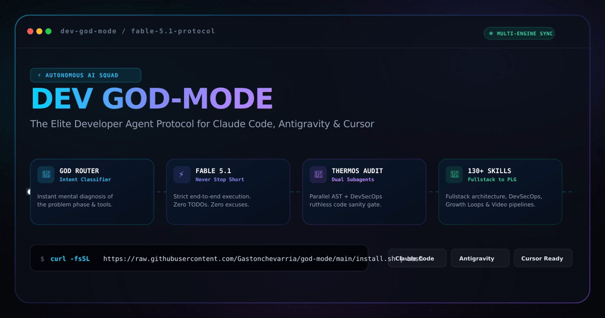

<div align="center">

<p align="center">
  
</p>

# ⚡ DEV GOD-MODE
### The Autonomous AI Engineering Squad for Claude Code, Cursor, Antigravity & Windsurf

[](https://opensource.org/licenses/MIT)
[](https://github.com/Gastonchevarria/god-mode)
[](https://github.com/Gastonchevarria/god-mode)
[](https://github.com/Gastonchevarria/god-mode)
[](https://github.com/Gastonchevarria/god-mode)

<br/>

**Transform Claude Code, Cursor, Antigravity and Windsurf into an elite, unstoppable developer team.**  
*Modular skill packs (zero context bloat), dual-engine zero-drift sync, double thermo-nuclear audits, anti-slop compiler, global CLI manager, and the strict Fable 5.1 autonomous execution standard.*

<br/>

[1-Minute Install](#-1-minute-install) • [Modular Packs](#-modular-packs-anti-context-bloat) • [The 5 King Commands](#-the-5-king-commands) • [CLI Manager](#-global-cli-manager-god-mode) • [Cursor & Windsurf](#-cursor--windsurf-support) • [Fable 5.1 Doctrine](#-the-fable-51-doctrine)

</div>

---

## 📺 Live Terminal Simulation (The Fable 5.1 Loop)

```text
$ claude
> /thermos audit current pull request against main

⚡ [GOD Router Activado - Fable 5.1 Tier]
- Diagnóstico: Auditoría pre-merge implacable sobre git diff (3,420 líneas modificadas).
- Ruta & Subagentes: THERMO-NUCLEAR REVIEW (Bugs Subagent + Code Quality Subagent).
- Estrategia: Análisis adversarial paralelo sin detenerse.

  [1/4] Spawning thermo-nuclear-review-subagent...          [OK] 0 breaking changes, 1 race condition fixed
  [2/4] Spawning thermo-nuclear-code-quality-subagent...    [OK] 1k-line rule enforced, 4 spaghettis refactored
  [3/4] Running Anti-Slop compiler on TypeScript types...    [OK] 14 'as any' purged, strict narrowing applied
  [4/4] Executing test suite and reporting outcomes...       [OK] 42/42 tests passing (100% green)

🎉 Audit Complete. Branch is 100% production-ready. Never Stopped Short.
```

---

## 🌟 Why GOD-Mode?

Most AI coding setups suffer from 4 fatal flaws:
1. **The "Stop Short" Fatigue**: The agent stops halfway, outputs a markdown list, and tells you: *"Now it's your turn to implement step 4 and 5"*.
2. **Context Bloat & Noise**: Dumping 130+ tools into an LLM window degrades tool selection accuracy by 30%.
3. **AI Slop & Lazy Code**: Unchecked `as any` casting, hallucinated APIs, and generic boilerplate.
4. **Ecosystem Fragmentation**: Prompts written for Claude Code don't work in Cursor, Windsurf, or Antigravity.

**DEV GOD-Mode solves all four in a single command.**

```
                                  ┌───────────────────────────┐
                                  │   USER INTENT / COMMAND   │
                                  └─────────────┬─────────────┘
                                                │
                                                ▼
                                  ┌───────────────────────────┐
                                  │    STARTUP GOD ROUTER     │
                                  │  (Intent Classification)  │
                                  └─────────────┬─────────────┘
                                                │
         ┌──────────────────┬───────────────────┼───────────────────┬──────────────────┐
         ▼                  ▼                   ▼                   ▼                  ▼
  ┌──────────────┐   ┌──────────────┐    ┌──────────────┐    ┌──────────────┐   ┌──────────────┐
  │   THERMOS    │   │  ANTI-SLOP   │    │   DEVSECOPS  │    │   ARCHIFY    │   │ MODULAR PACK │
  │ Double Audit │   │ Clean Code   │    │  Pre-Launch  │    │  System Map  │   │ Core/Dev/All │
  └──────────────┘   └──────────────┘    └──────────────┘    └──────────────┘   └──────────────┘
         │                  │                   │                   │                  │
         └──────────────────┴───────────────────┼───────────────────┴──────────────────┘
                                                │
                                                ▼
                                  ┌───────────────────────────┐
                                  │    FABLE 5.1 PROTOCOL     │
                                  │ (Never Stop Short Mandate)│
                                  └─────────────┬─────────────┘
                                                │
                   ┌────────────────────────────┼────────────────────────────┐
                   ▼                            ▼                            ▼
         ┌───────────────────┐        ┌───────────────────┐        ┌───────────────────┐
         │    CLAUDE CODE    │        │    ANTIGRAVITY    │        │ CURSOR & WINDSURF │
         │ (~/.claude/skills)│ ◄────► │ (~/.gemini/skills)│ ◄────► │ (.cursorrules)    │
         └───────────────────┘  Sync  └───────────────────┘  Sync  └───────────────────┘
```

---

## ⚡ 1-Minute Install

Run this single command in your terminal. It installs the **Core Pack** (18 essential skills to eliminate context bloat), subagents, and sets up the global `god-mode` CLI:

```bash
curl -fsSL https://raw.githubusercontent.com/Gastonchevarria/god-mode/main/install.sh | bash
```

### Choose Your Specialized Pack:

```bash
# Core Pack (Default - 18 skills: Fullstack, Security, Thermos, Anti-Slop. Zero context bloat)
curl -fsSL https://raw.githubusercontent.com/Gastonchevarria/god-mode/main/install.sh | bash -s -- --pack=core

# Dev Pack (55 skills: Core + Backend, Next.js, FastAPI, RAG, Evals, MCP Builder, Architecture)
curl -fsSL https://raw.githubusercontent.com/Gastonchevarria/god-mode/main/install.sh | bash -s -- --pack=dev

# Growth Pack (65 skills: Core + SaaS Monetization, SEO, CRO, Onboarding, Paywalls, Cold Email)
curl -fsSL https://raw.githubusercontent.com/Gastonchevarria/god-mode/main/install.sh | bash -s -- --pack=growth

# All Pack (133 skills: Complete Arsenal including Video/Media, Hyperframes, Remotion)
curl -fsSL https://raw.githubusercontent.com/Gastonchevarria/god-mode/main/install.sh | bash -s -- --pack=all
```

---

## 📦 Modular Packs (Anti-Context Bloat)

Loading 130+ tool schemas into an AI agent at session start causes **tool hallucination and prompt fatigue**. GOD-Mode solves this with **Instant Pack Switching**:

| Pack | Active Skills | Target Workflow | Context Weight |
| :--- | :---: | :--- | :---: |
| **`core`** *(Default)* | **18 skills** | Full-Stack Building, Thermos Review, DevSecOps, Anti-Slop | 🟢 Ultra-Light (<5% context) |
| **`dev`** | **55 skills** | Distributed Backend, FastAPI, Next.js, RAG Pipelines, Testing | 🟡 Medium (~12% context) |
| **`growth`** | **65 skills** | SaaS Monetization, Funnels, Programmatic SEO, Cold Email, CRO | 🟡 Medium (~14% context) |
| **`all`** | **133 skills** | Video production, motion graphics, Hyperframes & everything | 🔴 Heavy (Full loadout) |

You can switch packs in **1 second** at any time:
```bash
god-mode pack dev
god-mode pack growth
god-mode pack core
```

---

## 👑 The 5 King Commands

If you only use 5 commands, use these:

1. **`/god` (or `/startup-god-router`)**: The Brain. Tell it your problem in plain Spanish or English; it diagnoses your phase and activates the optimal multi-role sequence.
2. **`/thermos`**: The Reviewer. Launches two specialized subagents in parallel to audit your git diff for logic bugs, breaking API changes, and spaghetti maintainability before you merge.
3. **`/anti-slop`**: The Cleaner. Scans your TypeScript/JS codebase to eliminate lazy `as any` casting, hallucinated imports, and useless AI wrappers.
4. **`/security`**: The Shield. Runs an 8-point defensive DevSecOps audit checking for leaked credentials, SQL/Prompt injections, unauthenticated endpoints, and OWASP Top 10 vulnerabilities.
5. **`/archify`**: The Architect. Turns system flows, database structures, and API sequences into beautiful, explorable, standalone HTML/SVG interactive architecture diagrams.

---

## 🛠️ Global CLI Manager (`god-mode`)

The installation script deploys a global command line tool:

```bash
# Check current system status, active pack, and skill count
god-mode status

# Switch active skill packs instantly
god-mode pack <core|dev|growth|all>

# Update the entire suite from GitHub in 1 second
god-mode update

# Inject GOD-Mode rules into any project for Cursor and Windsurf
god-mode cursor

# Download and install any external skill from GitHub
god-mode add https://github.com/owner/repo/tree/main/skills/foo
```

---

## 💻 Cursor & Windsurf Support

We don't leave the 80% of developers using Cursor, Windsurf, or VS Code behind.

To enable GOD-Mode in any project:
```bash
god-mode cursor
```
This automatically generates:
- **`.cursorrules`**: Tailored for Cursor AI to enforce the Fable 5.1 Doctrine, Anti-Slop compilation, and Slash Commands.
- **`AGENTS.md`**: Cross-platform configuration recognized by Windsurf, Codex, and modern AI IDEs.

---

## 🥊 Vanilla Agents vs. DEV GOD-Mode

| Feature | Vanilla Claude / Antigravity | ⚡ DEV GOD-Mode |
| :--- | :---: | :---: |
| **Execution Autonomy** | Stops frequently for confirmation | **"Never Stop Short" Mandate (Executes all N steps)** |
| **Context Strategy** | Monolithic tool dump (Bloat) | **Modular Packs (`core`, `dev`, `growth`, `all`)** |
| **Update Mechanism** | Manual git pulls and copy-paste | **One command: `god-mode update`** |
| **Prompt Rationalization** | Hides or glosses over failures | **Reports actual tool outcomes on Line 1** |
| **Code Cleanliness** | Permissive with `any` & AI boilerplate | **Integrated Anti-Slop Compiler (`/anti-slop`)** |
| **Pre-Merge Audit** | Manual or single-pass check | **Double Thermo-Nuclear parallel review (`/thermos`)** |
| **Cross-IDE Support** | Locked to one IDE | **Claude Code + Antigravity + Cursor + Windsurf** |

---

## 📜 The Fable 5.1 Doctrine

Every agent in this suite adheres to the **Fable 5.1 Standard**:

1. **The "Never Stop Short" Mandate**: If a plan requires 5 steps, the agent executes all 5 steps autonomously. It never hands back an unfinished task with excuses.
2. **Final Paragraph Self-Check**: Before finishing a turn, the agent inspects its own output. If it contains a pending action ("Next I will...", "I plan to..."), **it must immediately stop and execute it**.
3. **Report Outcomes, Not Intentions**: The agent reports what actually occurred in the tools, never what it hoped would happen. Any failure is announced on **Line 1**.
4. **Look Before You Assert**: Grounding is mandatory. Inspect the filesystem with tools before assuming files or functions exist.
5. **No Thinking in Code Comments**: Code comments are strictly reserved for non-obvious business logic, not stream-of-consciousness monologues.

---

## 🤖 Specialized Subagents Panel

Located in `~/.claude/agents/`, ready to be dispatched for complex jobs:

- **`thermo-nuclear-review-subagent`**: Scans git diffs with an unforgiving lens for logic bugs, breaking changes, and regressions.
- **`thermo-nuclear-code-quality-review-subagent`**: Enforces strict maintainability, the 1000-line rule, and clean code judo.
- **`security-auditor`**: Dedicated DevSecOps auditor focused on attack vectors and zero-trust verification.
- **`code-reviewer`**: Senior Staff-level code review across 5 dimensions (correctness, readability, architecture, security, performance).
- **`test-engineer`**: QA specialist for test strategy, property-based tests, and edge-case coverage.
- **`web-performance-auditor`**: Core Web Vitals specialist (LCP, CLS, INP, memory leaks, and DOM weight).

---

## 🤝 Contributing

We welcome contributions from engineering teams and developers worldwide!
1. Fork the repository
2. Add your skill folder into `skills/<your-skill>/` with a valid `SKILL.md` (YAML frontmatter with `name` and `description`)
3. Test with `./install.sh`
4. Submit a Pull Request

---

## 📄 License

Distributed under the **MIT License**. Created with passion by [Gaston Chevarria](https://github.com/Gastonchevarria).

<div align="center">

**⭐ If this suite saves you hundreds of hours of coding, please give it a Star! ⭐**

[](https://github.com/Gastonchevarria/god-mode)

</div>
